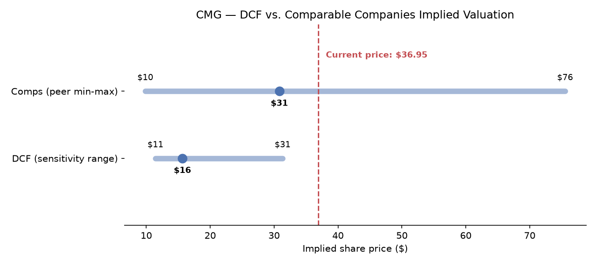

# CMG Valuation Model

A DCF and comparable companies valuation of Chipotle Mexican Grill (NYSE: CMG), built in Python with live data from [yfinance](https://github.com/ranaroussi/yfinance).

**TL;DR:** As of the last data pull, CMG traded at **$36.95**. This model's base-case DCF implies **$15.65/share**, and a comps-based range (peer EV/Revenue and EV/EBITDA multiples applied to CMG) implies **$9.85–$75.54**, median around **$31**. In short: the market is pricing in more growth/durability than a conservative base case captures — see [Interpreting the gap](#interpreting-the-gap-to-market-price) below for why, and the [sensitivity table](#sensitivity-wacc-vs-terminal-growth) for what assumptions would justify the current price.



## What this is

Two independent valuation approaches, each in its own module, tied together by one script:

1. **DCF** — projects CMG's revenue, margins, and free cash flow for 5 years, discounts them (plus a terminal value) back to a present enterprise value, then bridges to an implied share price.
2. **Comparable companies ("comps")** — takes trading multiples (EV/Revenue, EV/EBITDA, P/E) from six public fast-casual/restaurant peers and applies them to CMG's own financials to imply a valuation range.

Neither approach is "the answer" — they're two different lenses, and the gap between them (and vs. the current market price) is itself the interesting output.

## Repo structure

```
config/assumptions.yaml     All inputs in one place — growth rates, margins, WACC components, comp set
src/data/fetch.py           Pulls & locally caches financials via yfinance (reproducible re-runs)
src/dcf/                    Revenue/FCF projection, WACC, terminal value, sensitivity table
src/comps/                  Peer multiples table, implied valuation from comps
src/output/                 Chart and table generation
main.py                     Runs the full pipeline end to end
notebooks/walkthrough.ipynb Thin, narrated notebook over the same src/ modules (no separate logic)
outputs/                    Generated tables (CSV + Markdown) and charts (PNG)
tests/test_dcf.py           Sanity checks on the DCF math
```

## How to run it

```bash
python -m venv .venv
.venv\Scripts\activate        # or: source .venv/bin/activate on macOS/Linux
pip install -r requirements.txt
python main.py
```

This regenerates everything in `outputs/`. Data pulled from yfinance is cached to `src/data/cache/` by pull date, so re-running the same day reuses the cached snapshot instead of hitting the network — and the cached files are committed, so the results in this README are reproducible even without a live data pull.

Run the test suite with:

```bash
pytest tests/
```

## Methodology & assumptions

Every number below lives in [`config/assumptions.yaml`](config/assumptions.yaml) — nothing is hardcoded inside the calculation logic.

### Revenue growth

| | FY2026 | FY2027 | FY2028 | FY2029 | FY2030 |
|---|---|---|---|---|---|
| Growth | 9.2% | 10.0% | 9.0% | 8.0% | 7.0% |

CMG's revenue growth decelerated sharply in FY2025 (+5.4%, down from +14.3% in FY2024 and +14.4% in FY2023) amid a well-documented comp-sales slowdown. Year 1–2 anchor to analyst consensus (+9.2% / +10.8%, pulled from yfinance), then the growth rate fades toward a more sustainable long-run pace as the restaurant base matures — a standard fade pattern for a maturing growth compounder.

### Margins & reinvestment

- **Operating margin**: holds around 16.5%, drifting to 17.5% by Year 5 — within CMG's actual 4-year range of 14.0%–17.5%, assuming modest ongoing operating leverage rather than a big margin inflection either way.
- **CapEx**: ~5.5% of revenue tapering to 5.0%, matching the recent 4-year average; funds continued new-restaurant growth.
- **D&A**: held flat at ~3.0% of revenue, matching recent actuals.
- **Net working capital**: a small ongoing cash use (0.3% of revenue), consistent with recent history.
- **Tax rate**: 25%, slightly above the trailing effective rate of 23.6% — a deliberately conservative round number.

### Cost of capital (WACC)

CMG carries **no traditional bonds or bank debt**. The ~$5.1B of "debt" on its balance sheet is entirely capitalized operating lease liabilities (nearly all its restaurants are leased, not owned or financed conventionally), and lease expense is already embedded above the operating-income line.

Given that, WACC is set equal to the **CAPM cost of equity**, treating CMG as effectively all-equity-funded — the more common practitioner treatment for restaurant chains in this situation:

```
Cost of equity = Risk-free rate + Beta × Equity risk premium
              = 4.8%          + 0.94 × 5.0%
              = 9.49%
```

- **Risk-free rate**: current 10-year US Treasury yield (4.8%)
- **Beta**: 0.94, CMG's 5-year monthly beta per yfinance
- **Equity risk premium**: 5.0%, a standard long-run US equity risk premium

*Alternative considered:* capitalizing the lease liability as debt in the WACC weights (using CMG's lease discount rate, ~4.5%, as pre-tax cost of debt) instead moves WACC to roughly 8.9% — a small effect, since the implied debt weight is only ~10% of enterprise value. The simpler all-equity treatment is used throughout, but this is a legitimate point of debate and worth knowing about if you disagree with it.

Even though leases are excluded from the WACC capital-structure weights, the **enterprise-value-to-equity bridge still nets out the lease liability** (and adds back cash) — it's a real balance-sheet claim ahead of equity holders regardless of how it's treated for WACC purposes.

### Terminal value

Gordon growth (perpetuity growth) method, with a 3.0% terminal growth rate — roughly a long-run nominal GDP proxy, comfortably below the 9.49% WACC.

## Sensitivity: WACC vs. terminal growth

Implied share price across a range of WACC and terminal growth assumptions ([full table](outputs/tables/dcf_sensitivity.csv)):

| WACC \ g | 2.0% | 2.5% | 3.0% | 3.5% | 4.0% |
|---|---|---|---|---|---|
| 7.5% | $20.01 | $21.99 | $24.42 | $27.44 | $31.33 |
| 8.0% | $17.99 | $19.61 | $21.55 | $23.93 | $26.90 |
| 8.5% | $16.27 | $17.62 | $19.21 | $21.12 | $23.45 |
| **9.0%** | $14.80 | $15.93 | $17.25 | $18.82 | $20.69 |
| **9.5%** | $13.53 | $14.49 | **$15.60** | $16.90 | $18.43 |
| 10.0% | $12.42 | $13.24 | $14.19 | $15.28 | $16.56 |
| 10.5% | $11.43 | $12.15 | $12.97 | $13.89 | $14.97 |

Even at the most generous corner of this grid (7.5% WACC, 4.0% terminal growth), the DCF implies $31.33 — still below the current $36.95 price. Closing that gap fully requires either a WACC below this grid's range, faster/longer-duration growth than the base-case revenue path assumes, or materially higher margins than modeled.

## Comparable companies

Peer set: Sweetgreen (SG), Shake Shack (SHAK), Wingstop (WING), Domino's (DPZ), Yum! Brands (YUM), CAVA Group (CAVA) — a mix of fast-casual pure-plays and larger franchisors, chosen for revenue-model similarity (restaurant/franchise economics) over CMG's exact growth profile.

| Ticker | EV/Revenue | EV/EBITDA | P/E | Revenue growth |
|---|---|---|---|---|
| SG | 1.51x | n/m (loss-making) | 77.2x | 3.8% |
| SHAK | 2.24x | 20.2x | 71.0x | 17.2% |
| WING | 5.72x | 17.6x | 25.8x | 6.4% |
| DPZ | 3.23x | 15.9x | 19.0x | 4.3% |
| YUM | 6.18x | 17.6x | 18.8x | 12.2% |
| CAVA | 5.23x | 44.7x | 107.4x | 31.3% |
| **CMG** | 4.15x | 22.6x | 34.2x | 9.3% |

Full detail (including implied share price by multiple) is in [`outputs/tables/comps_implied_valuation.csv`](outputs/tables/comps_implied_valuation.csv).

**P/E is excluded from the headline comps range.** CAVA's ~107x P/E (a hyper-growth outlier still scaling toward maturity) and Sweetgreen's near-breakeven GAAP earnings make P/E an unreliable cross-sectional comparison across this peer set — a small change in one company's earnings swings its multiple enormously. EV/Revenue and EV/EBITDA are capital-structure- and earnings-quality-agnostic and are used as the primary comps range instead:

**Comps-implied range: $9.85 – $75.54, median-multiple midpoint ≈ $31**

## Interpreting the gap to market price

Both methods land below CMG's current $36.95 price at their base case/median. That's not a bug — it's a legitimate, common outcome when valuing a stock the market has historically rewarded with a premium multiple (CMG's own EV/EBITDA of 22.6x is above every peer except CAVA). A few honest explanations for the gap, none of which this model tries to capture:

- The market may be pricing in a longer runway of double-digit growth than this model's fading growth path assumes (e.g. continued strong new-unit economics, further international expansion, Chipotlanes, digital/loyalty flywheel effects).
- A lower risk-free-rate or ERP assumption, or a re-rating of CMG's beta, would raise the DCF's valuation — the sensitivity table above shows how much.
- Comps-based valuation is sensitive to which peers are included; a peer set weighted more toward high-growth names (like CAVA) rather than mature franchisors (like YUM, DPZ) would imply a higher range.

## Limitations

- **Single-scenario base case.** No explicit bull/bear case beyond the WACC × terminal growth sensitivity grid.
- **yfinance data quality.** Some fields (e.g. beta, EBITDA) are yfinance's own derived figures rather than pulled directly from filings, and can differ from other data providers.
- **Small comp set.** Six peers is enough for a directional range, not a statistically robust sample — P/E in particular is easily skewed by one or two names (see above).
- **No explicit lease-as-debt scenario implemented in code**, only discussed in the WACC section — would be a natural next extension if you want to quantify that alternative rather than just describe it.

## Resume bullet

> Built a Python DCF and comparable-companies valuation model for Chipotle (CMG) using live market data (yfinance), including a 5-year FCF projection, CAPM-based WACC, WACC/terminal-growth sensitivity analysis, and a 6-company comps table — packaged as a tested, modular repo rather than a single notebook.
