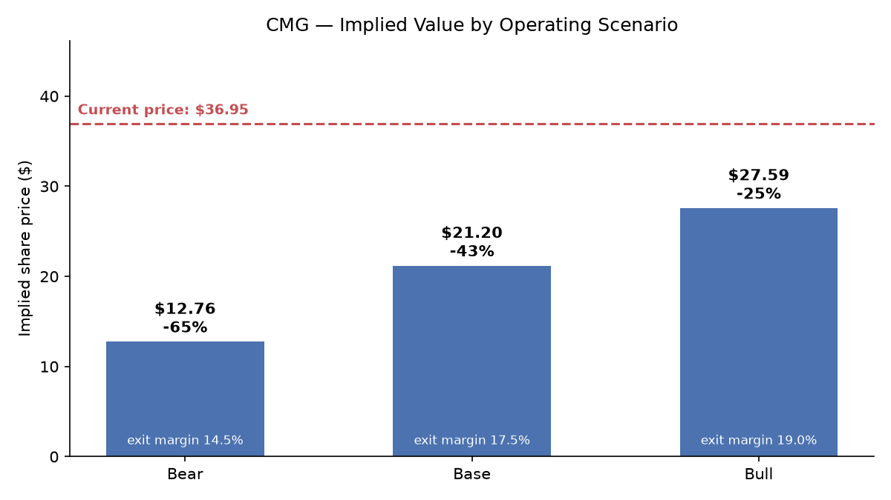

# CMG Valuation Model

[](https://github.com/shash825/cmg-valuation-model/actions/workflows/tests.yml)

A DCF and comparable companies valuation of Chipotle Mexican Grill (NYSE: CMG), built in Python with live data from [yfinance](https://github.com/ranaroussi/yfinance).

**TL;DR:** As of the last data pull, CMG traded at **$36.95**. This model's base-case DCF implies **$21.20/share**, with a bear case of **$12.76** and a bull case of **$27.59**. A comps-based range (peer EV/Revenue and EV/EBITDA multiples applied to CMG) implies **$10.45–$80.14**, median-multiple midpoint around **$33**. In short: the market is pricing in more growth/durability than a conservative base case captures — see [Interpreting the gap](#interpreting-the-gap-to-market-price) below for why, and the [sensitivity table](#sensitivity-wacc-vs-terminal-growth) for what assumptions would justify the current price. At the generous corner of that grid the DCF reaches $38.10, just above the market price — so today's valuation is *reachable* on defensible inputs, but only at the edge of them.




## What this is

Two independent valuation approaches, each in its own module, tied together by one script:

1. **DCF** — projects CMG's revenue, margins, and free cash flow for 5 years, discounts them (plus a terminal value) back to a present enterprise value, then bridges to an implied share price.
2. **Comparable companies ("comps")** — takes trading multiples (EV/Revenue, EV/EBITDA, P/E) from six public fast-casual/restaurant peers and applies them to CMG's own financials to imply a valuation range.

Neither approach is "the answer" — they're two different lenses, and the gap between them (and vs. the current market price) is itself the interesting output.

## Repo structure

```
config/assumptions.yaml     All inputs in one place — growth rates, margins, WACC components, comp set
src/data/fetch.py           Pulls & locally caches financials via yfinance (reproducible re-runs)
src/dcf/                    Revenue/FCF projection, WACC, terminal value, EV->equity bridge,
                            discount-rate sensitivity, bull/base/bear scenarios
src/comps/                  Peer multiples table, implied valuation from comps
src/output/                 Chart and table generation
main.py                     Runs the full pipeline end to end
notebooks/walkthrough.ipynb Thin, narrated notebook over the same src/ modules (no separate logic)
outputs/                    Generated tables (CSV + Markdown) and charts (PNG)
tests/test_dcf.py           Sanity checks on the DCF math and the equity bridge
tests/test_comps.py         Checks on peer eligibility — which multiples are meaningful
tests/test_scenarios.py     Scenario isolation, ordering, and terminal-value diagnostics
tests/test_share_count.py   Share-count vintage: the count must match the price it's compared to
```

## How to run it

```bash
python -m venv .venv
.venv\Scripts\activate        # or: source .venv/bin/activate on macOS/Linux
pip install -r requirements.txt
python main.py
```

This regenerates everything in `outputs/`. Data pulled from yfinance is cached to `src/data/cache/` by pull date, so re-running the same day reuses the cached snapshot instead of hitting the network — and the cached files are committed, so the results in this README are reproducible even without a live data pull.

Run the test suite with:

```bash
pytest tests/
```

## Methodology & assumptions

Every number below lives in [`config/assumptions.yaml`](config/assumptions.yaml) — nothing is hardcoded inside the calculation logic.

### Revenue growth

| | FY2026 | FY2027 | FY2028 | FY2029 | FY2030 |
|---|---|---|---|---|---|
| Growth | 9.2% | 10.0% | 9.0% | 8.0% | 7.0% |

CMG's revenue growth decelerated sharply in FY2025 (+5.4%, down from +14.3% in FY2024 and +14.4% in FY2023) amid a well-documented comp-sales slowdown. Year 1–2 anchor to analyst consensus (+9.2% / +10.8%, pulled from yfinance), then the growth rate fades toward a more sustainable long-run pace as the restaurant base matures — a standard fade pattern for a maturing growth compounder.

### Margins & reinvestment

- **Operating margin**: holds around 16.5%, drifting to 17.5% by Year 5 — within CMG's actual 4-year range of 14.0%–17.5%, assuming modest ongoing operating leverage rather than a big margin inflection either way.
- **CapEx**: ~5.5% of revenue tapering to 5.0%, matching the recent 4-year average; funds continued new-restaurant growth.
- **D&A**: held flat at ~3.0% of revenue, matching recent actuals.
- **Net working capital**: 2.0% of the *change* in revenue, not of the revenue level. NWC is a balance-sheet stock, so only its year-over-year movement is a cash flow — charging a percentage of total revenue every year would bill the business again and again for working capital it already funded. 2.0% of incremental revenue is deliberately cautious for this business: CMG collects from guests at the register and pays suppliers on terms, so it actually runs *negative* working capital and growth arguably releases cash. Setting the assumption negative in the config models that; the base case stays conservative.
- **Tax rate**: 25%, slightly above the trailing effective rate of 23.6% — a deliberately conservative round number.

### Cost of capital (WACC)

CMG carries **no traditional bonds or bank debt**. The ~$5.1B of "debt" on its balance sheet is entirely capitalized operating lease liabilities (nearly all its restaurants are leased, not owned or financed conventionally), and lease expense is already embedded above the operating-income line.

Given that, WACC is set equal to the **CAPM cost of equity**, treating CMG as effectively all-equity-funded — the more common practitioner treatment for restaurant chains in this situation:

```
Cost of equity = Risk-free rate + Beta × Equity risk premium
              = 4.8%          + 0.94 × 5.0%
              = 9.49%
```

- **Risk-free rate**: current 10-year US Treasury yield (4.8%)
- **Beta**: 0.94, CMG's 5-year monthly beta per yfinance
- **Equity risk premium**: 5.0%, a standard long-run US equity risk premium

*Alternative considered:* capitalizing the lease liability as debt in the WACC weights (using CMG's lease discount rate, ~4.5%, as pre-tax cost of debt) instead moves WACC to roughly 8.9% — a small effect, since the implied debt weight is only ~10% of enterprise value. The simpler all-equity treatment is used throughout, but this is a legitimate point of debate and worth knowing about if you disagree with it.

### The lease decision, and why the bridge is consistent with it

This is the one choice that most moves the answer, so it lives in its own module, [`src/dcf/equity_bridge.py`](src/dcf/equity_bridge.py), rather than as a bare subtraction inside `main.py`.

Rent expense is **already deducted above the operating-income line**. That means the economic cost of CMG's leases is already inside the unlevered free cash flow this model discounts. Subtracting the ~$5.4B capitalized lease liability *again* in the enterprise-value-to-equity bridge would charge shareholders twice for the same obligation — worth **$4.04/share**, or most of the model's original gap to market.

There are exactly two internally consistent treatments:

| | Cash flows | WACC weights | Net debt |
|---|---|---|---|
| **Operating-lease treatment** (used here) | EBIT after rent | All-equity | Leases excluded |
| **Capitalized-lease treatment** | Add rent back to EBIT, depreciate the ROU asset | Lease liability as debt | Leases included |

Mixing them — expensing rent in the cash flows *and* treating leases as debt in the bridge — is a common error and the specific one this module exists to prevent. Flipping `equity_bridge.treat_leases_as_debt` in the config switches the bridge, so the alternative can be quantified rather than only described.

Under the operating-lease treatment CMG has **no financial debt at all**, so net debt is simply negative cash: **–$0.68B**. Enterprise value of $26.14B bridges to $26.82B of equity value, or $21.20 per share on the current count.

**The comps side deliberately uses the opposite convention.** Peer EV/Revenue and EV/EBITDA multiples are quoted on a lease-*inclusive* enterprise value, because the data provider rolls lease liabilities into total debt for every company in the peer set. Applying those multiples to CMG therefore requires a lease-inclusive bridge to stay apples-to-apples. Using the DCF's bridge there would inflate the comps-implied price by measuring CMG on a different basis than the peers it is being compared to.

### Terminal value, and the check that matters

Gordon growth (perpetuity growth) method, with a 3.0% terminal growth rate — roughly a long-run nominal GDP proxy, comfortably below the 9.49% WACC.

Terminal value is most of any DCF, so the model reports what its terminal year actually *implies* rather than leaving that buried inside the capex assumption:

| Terminal-year diagnostic | Value |
|---|---|
| CapEx / D&A | 1.67x |
| Net reinvestment (capex − D&A + ΔNWC) | $384M |
| Net reinvestment as % of NOPAT | 16.2% |
| **Implied return on new capital** (g ÷ reinvestment rate) | **18.5%** |

The first line looks alarming on its own: capex running at 1.67x depreciation forever, for a business growing 3%. The last line is the one that matters. Net of the depreciation it is replacing, that capex is only 16.2% of after-tax operating profit, which implies an 18.5% return on the capital being added. For a business earning high-teens-to-low-20s returns, that is a reasonable steady state, not an aggressive one.

Reporting both numbers is the point: judging the terminal value off the raw capex ratio would flag a problem that isn't there. `terminal_method: reinvestment_rate` in the config inverts the calculation and derives terminal value from a return-on-capital assumption directly, which makes the growth-versus-returns trade-off explicit — growth only creates value while ROIC exceeds WACC.

### Share count

The bridge divides by **today's** share count, implied by market cap ÷ price (1.265B), not last fiscal year's **average** diluted count (1.343B). CMG has been buying back stock, so the fiscal-year average is ~6.1% too high. Dividing an equity value by a stale count and then comparing the answer to today's quoted price mixes two vintages and understates value per share by that same 6%.

## Sensitivity: WACC vs. terminal growth

Implied share price across a range of WACC and terminal growth assumptions ([full table](outputs/tables/dcf_sensitivity.csv)):

| WACC \ g | 2.0% | 2.5% | 3.0% | 3.5% | 4.0% |
|---|---|---|---|---|---|
| 7.5% | $25.90 | $28.03 | $30.64 | $33.90 | **$38.10** |
| 8.0% | $23.71 | $25.46 | $27.55 | $30.11 | $33.32 |
| 8.5% | $21.86 | $23.32 | $25.03 | $27.09 | $29.60 |
| **9.0%** | $20.28 | $21.50 | $22.93 | $24.61 | $26.63 |
| **9.5%** | $18.91 | $19.95 | **$21.15** | $22.55 | $24.20 |
| 10.0% | $17.71 | $18.60 | $19.62 | $20.80 | $22.17 |
| 10.5% | $16.65 | $17.43 | $18.30 | $19.31 | $20.46 |

Exactly one cell in this grid clears the $36.95 market price: 7.5% WACC with 4.0% terminal growth, at $38.10. That is the useful result. The market's valuation is *reachable* on defensible inputs rather than requiring something absurd, but it needs a cost of equity two full points below the CAPM output **and** terminal growth above long-run nominal GDP, simultaneously. At the base-case WACC of 9.49%, no terminal growth rate in this range gets there.

## Scenarios: flexing the business, not the discount rate

The grid above asks what the *same forecast* is worth to investors demanding different returns. It cannot tell you what CMG is worth if comparable sales turn negative. These scenarios flex the operating assumptions instead — revenue path, margins, terminal growth — at a constant 9.49% WACC ([full table](outputs/tables/dcf_scenarios.csv)):

| Scenario | Exit revenue | Exit margin | Terminal g | Implied ROIC | Implied price | vs. market |
|---|---|---|---|---|---|---|
| **Bear** | $14.3B | 14.5% | 2.0% | 10.6% | $12.76 | −65% |
| **Base** | $18.0B | 17.5% | 3.0% | 18.5% | $21.20 | −43% |
| **Bull** | $20.5B | 19.0% | 3.5% | 22.9% | $27.59 | −25% |

Each scenario overrides only the assumptions it declares; everything else falls through to the shared config block, so the cases stay honest about what actually differs between them. A typo in a scenario key raises an error rather than silently changing nothing.

Two things worth stating plainly:

- **Even the bull case doesn't reach the market price.** Getting to $36.95 on operating assumptions alone would need something more aggressive than a 19.0% exit margin, which is already *above* CMG's four-year peak of 17.5%. The market price is more easily explained by a lower discount rate than by better operations, which is a genuinely different claim about why the stock is expensive.
- **The bear case's implied 10.6% return on capital is still above the 9.49% WACC.** Even when growth stalls and margins revert, this model has CMG creating value at the margin. A true bear case would need returns to fall below the cost of capital, and nothing in these assumptions does that.

## Comparable companies

Peer set: Sweetgreen (SG), Shake Shack (SHAK), Wingstop (WING), Domino's (DPZ), Yum! Brands (YUM), CAVA Group (CAVA) — a mix of fast-casual pure-plays and larger franchisors, chosen for revenue-model similarity (restaurant/franchise economics) over CMG's exact growth profile.

| Ticker | EV/Revenue | EV/EBITDA | P/E | Revenue growth |
|---|---|---|---|---|
| SG | 1.51x | n/m (loss-making) | n/m (loss-making) | 3.8% |
| SHAK | 2.24x | 20.2x | 71.0x | 17.2% |
| WING | 5.72x | 17.6x | 25.8x | 6.4% |
| DPZ | 3.23x | 15.9x | 19.0x | 4.3% |
| YUM | 6.18x | 17.6x | 18.8x | 12.2% |
| CAVA | 5.23x | 44.7x | 107.4x | 31.3% |
| **CMG** | 4.15x | 22.6x | 34.2x | 9.3% |

Full detail (including implied share price by multiple) is in [`outputs/tables/comps_implied_valuation.csv`](outputs/tables/comps_implied_valuation.csv).

**Sweetgreen is screened out of the P/E statistics.** yfinance reports a positive ~77x "trailing" P/E for SG on *negative* GAAP EPS of –$1.14, which is a forward or normalized figure surfaced under a trailing field. A positive reported multiple is not evidence of positive earnings, so the peer filter tests net income and diluted EPS directly rather than trusting the multiple's sign. Leaving SG in pulled the peer P/E median from 25.8x up to 48.4x — nearly double — on the strength of a number that means nothing.

**P/E is still excluded from the headline comps range.** Even after that screen, CAVA's ~107x P/E (a hyper-growth outlier still scaling toward maturity) makes P/E a fragile cross-sectional comparison across a peer set this small. EV/Revenue and EV/EBITDA are capital-structure- and earnings-quality-agnostic and are used as the primary comps range instead:

**Comps-implied range: $10.45 – $80.14, median-multiple midpoint ≈ $33**

Worth noting: with the loss-maker screened out, the median P/E of 25.8x implies **$29.43/share** — squarely in line with the EV/EBITDA median of $29.28 and within range of the EV/Revenue median of $36.11. The corrected P/E now corroborates the headline range instead of contradicting it, which is itself a check that the screen was the right call.

## Interpreting the gap to market price

Both methods still land below CMG's current $36.95 price at their base case/median, though less dramatically than an earlier version of this model implied — see the [lease decision](#the-lease-decision-and-why-the-bridge-is-consistent-with-it) for why. That's not a bug — it's a legitimate, common outcome when valuing a stock the market has historically rewarded with a premium multiple (CMG's own EV/EBITDA of 22.6x is above every peer except CAVA). A few honest explanations for the gap, none of which this model tries to capture:

- The market may be pricing in a longer runway of double-digit growth than this model's fading growth path assumes (e.g. continued strong new-unit economics, further international expansion, Chipotlanes, digital/loyalty flywheel effects).
- A lower risk-free-rate or ERP assumption, or a re-rating of CMG's beta, would raise the DCF's valuation — the sensitivity table above shows how much.
- Comps-based valuation is sensitive to which peers are included; a peer set weighted more toward high-growth names (like CAVA) rather than mature franchisors (like YUM, DPZ) would imply a higher range.

## Limitations

- **Scenarios flex revenue, margins, and terminal growth only.** CapEx, D&A, working capital, tax rate, and beta are held constant across bear/base/bull. A genuine bear case would probably also assume worse unit economics, not just fewer units.
- **yfinance data quality.** Some fields (e.g. beta, EBITDA) are yfinance's own derived figures rather than pulled directly from filings, and can differ from other data providers.
- **Small comp set.** Six peers is enough for a directional range, not a statistically robust sample — P/E in particular is easily skewed by one or two names (see above).
- **The implied-ROIC diagnostic is a check, not a constraint.** The model reports the return its terminal value assumes but does not force that number to match CMG's actual historical return on capital. Reading the diagnostic is still a manual step.
- **The current share count is derived, not reported.** Market cap ÷ price recovers the count the market is pricing but is a basic figure, so it excludes unexercised dilution. The reported diluted average is stale in the other direction. Neither is exactly right.
- **The lease-as-debt alternative is a config toggle, not a fully modeled scenario.** Flipping `treat_leases_as_debt` changes the bridge but does not add rent back to EBIT or depreciate the right-of-use asset, so it shows the direction of that treatment rather than a complete implementation of it.
